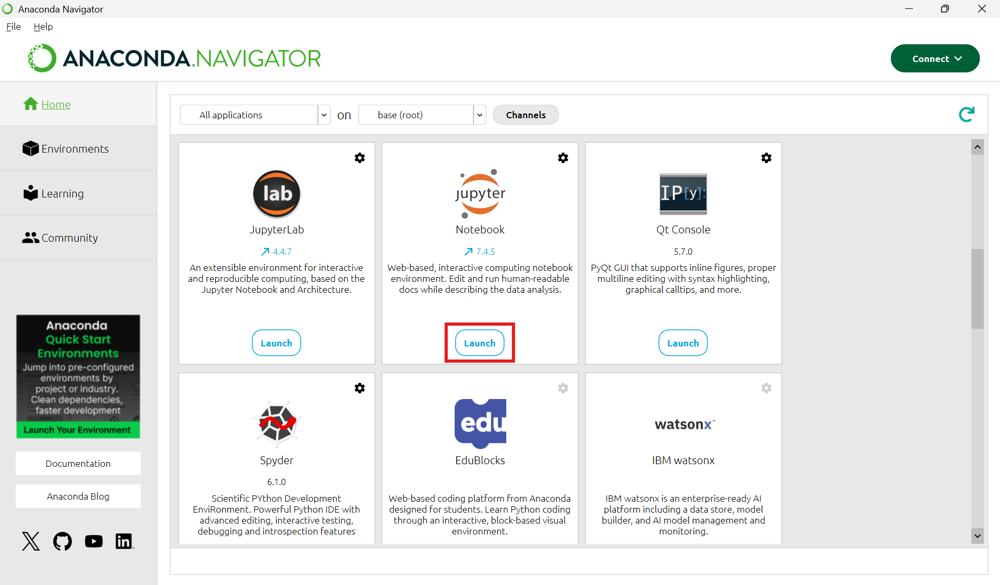
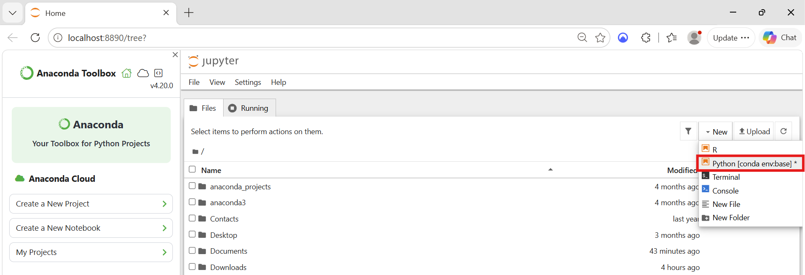
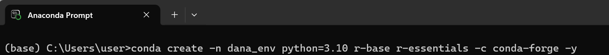
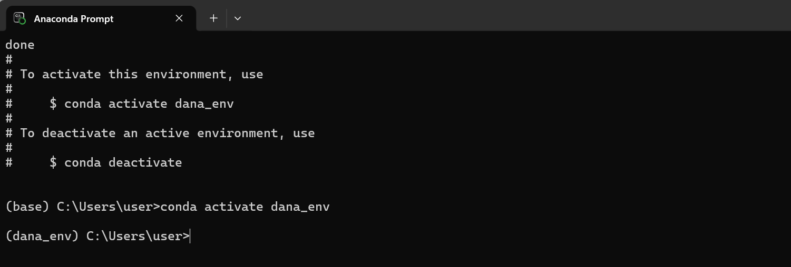
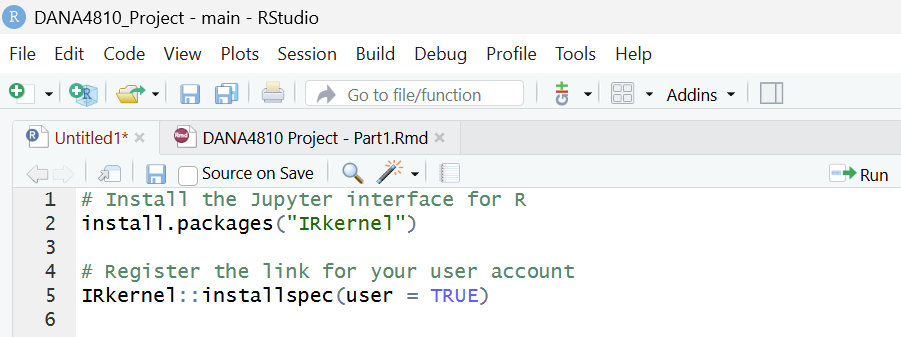
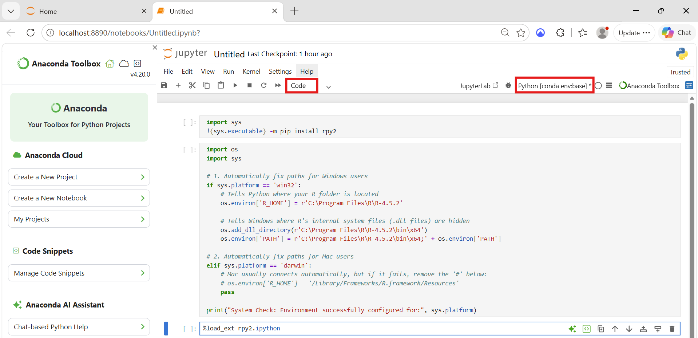
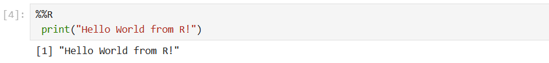
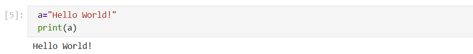

```{r setup, include=FALSE}
knitr::opts_chunk$set(echo = TRUE)
```

**Course: DANA 4810**

**Team members: Nandini Bhatia, Diego Alberto, Khushpreet Kaur, Haruka Sawakami**

# Instruction Manual
## Using Python and R in a Single Jupyter Notebook


## 1. Introduction
In today's world of analytics, professionals often need to use both Python and R to benefit the unique strengths of both languages. R excels in statistical models and graphics with ggplot2 or other libraries. Whereas python is known as the industry standard for general-purpose programming, big data and machine learning.

Traditionally, our company has used R through RStudio. However, it is becoming important to use a platform which supports both Python and R Programs in one place. This manual provides thorough information on how to install and use Jupyter Notebook, how to run both Python and R codes within a single notebook file. This guide is applicable to both Windows and Mac users. It is written for beginners and is clear, simple to understand and assumes no previous knowledge of Python.

### What is Jupyter Notebook?
Jupyter Notebook is an interactive computational environment that facilitates writing code, executing programs, presenting output, and annotating all these aspects within one single document. Being compatible with several programming languages such as Python and R, it becomes an excellent tool for data analysis tasks.


## 2. Setting Up the Environment
The easiest way to use Jupyter Notebook is through Anaconda to run Python and R program. It comes with conda, a package manager that makes handling environment easy. 

### Step 1: Install Anaconda

#### For Windows users
**[How to Install]**

1. Download the Anaconda Individual Edition installer for Windows from ([anaconda.com](https://www.anaconda.com/download)).
2. Run the .exe installer.
3. Choose **Just Me** as recommended and select the default installation path.
4. Make sure that under "Advanced Installation Options", leave **"Add Anaconda to my PATH environment variable" unchecked.** Just use the 'Anaconda Prompt' from the start menu to run commands.
5. Click 'Install', then click 'Finish' once complete. 

**[How to Open Jupyter Notebook]**

1. Open start menu and select Anaconda Navigator.
2. Select Jupyter Notebook, then launch.
```{r, echo=FALSE, out.width="80%", fig.align="left"}

```
3. Jupyter Notebook will open in browser.
4. Click 'New' and select 'Python', and it is ready for running codes.<br>
   Note: Please do not close the Command Prompt window while using Jupyter Notebook, as it needs to remain open.
```{r, echo=FALSE, out.width="80%", fig.align="left"}

```


#### For Mac (macOS) Users 
**[How to Install]**

1. Download the Anaconda Individual Edition installer for Mac from ([anaconda.com](https://www.anaconda.com/download)).
2. Open the downloaded .pkg file.
3. Follow the installation wizard and complete the installation. 
4. Once completed, open the Terminal app from Finder (Applications > Utilities > Terminal).<br>
   Note: Recent macOS.pkg installers install Anaconda in the/opt directory and may need admin authorisation during installation.

**[How to Open Jupyter Notebook]**

1. Open 'Anaconda Navigator' from applications.
2. Click Jupyter Notebook, then launch.
3. Jupyter Notebook will open in browser.
4. Click 'New' and select 'Python', and it is ready for running codes.<br>
   Note: Please do not close the Command Prompt window while using Jupyter Notebook, as it needs to remain open.


### Step 2: Create a Joint Conda Environment
Creating an isolated virtual environment prevents library version conflicts. We will create an environment named 'dana_env' including Python, R and Jupyter package.

1. Open 'Anaconda Prompt' on Windows or Terminal on macOS.
2. Run the following command to create your environment.<br>
   conda create -n dana_env python=3.10 r-base r-essentials -c conda-forge -y
```{r, echo=FALSE, out.width="90%", fig.align="left"}

```
   Note: r-essentials installs R, the IRkernel (allowing Jupyter to run R), and over 200 popular R packages (such as ggplot2 and dplyr).

3. Run the following command to activate the new environment.<br>
   conda activate dana_env
```{r, echo=FALSE, out.width="90%", fig.align="left"}

```


## 3. Creating a Seperate Notebook for Each Langauge
In Jupyter dashboard, you can create a notebook in either Python or R based upon your needs.

**[How to Create a Notebook for only R program]**

1. Firstly, run the following command in **RStudio**.<br>
   install.packages("IRkernel")<br>
   IRkernel::installspec(user = TRUE)
```{r, echo=FALSE, out.width="50%", fig.align="left"}

```
   Note: This code will help us install **IRkernel** which act as R engine and makes it possible to run R code in Jupyter Notebook.
    
2. Open **Jupyter Notebook**, then in the upper right corner click **'New'** and select **'Python'** from the options.
3. A page will be opened where you can run codes.
4. Then run the following codes in Jupyter Notebook.

        import sys
        !{sys.executable} -m pip install rpy2
          
   In a second cell run this: 
   
        import os
        import sys

        # 1. Automatically fix paths for Windows users
        if sys.platform == 'win32':
            # Tells Python where your R folder is located
            os.environ['R_HOME'] = r'C:\Program Files\R\R-4.5.2'
            
            # Tells Windows where R's internal system files (.dll files) are hidden
            os.add_dll_directory(r'C:\Program Files\R\R-4.5.2\bin\x64')
            os.environ['PATH'] = r'C:\Program Files\R\R-4.5.2\bin\x64;' + os.environ['PATH']
        
        # 2. Automatically fix paths for Mac users
        elif sys.platform == 'darwin':
            # Mac usually connects automatically, but if it fails, remove the '#' below:
            # os.environ['R_HOME'] = '/Library/Frameworks/R.framework/Resources'
            pass
        
        print("System Check: Environment successfully configured for:", sys.platform)

   In a third cell run this: 
   
        %load_ext rpy2.ipython

   Note: Make sure that cell settings should be 'Code' and always use 'Python' mode.
   
```{r, echo=FALSE, out.width="90%", fig.align="center"}

```

5. With all these changes we are all setup and ready to work.
6. Here is a sample code to test if it works properly or not:

        %%R
        print("Hello World from R!")

```{r, echo=FALSE, out.width="70%", fig.align="left"}

```
        
**[How to Create a Notebook for only Python program]**

1. Open **Jupyter Notebook**, then in the upper right corner click **'New'** and select **'Python'** from the options.
2. A page will be opened where you can run codes.
3. Here is a sample code to test if it works properly or not:

        a="Hello World!"
        print(a)
        
```{r, echo=FALSE, out.width="70%", fig.align="left"}

```
        

## 4. Creating Single Notebook for Both Langauges
For running both languages in single Jupyter Notebook, we will use Python kernel as the base and will run R commands using **rpy2 library**.

### Step 1: Loading R magic in Jupyter Notebook
In order to run any R command in Python, we always first need to create a Python notebook and then loading R magic extension at the very beginning.

To load the extension always use:

    %load_ext rpy2.ipython
      
### Step 2: How to run R commands in Jupyter cells
Now for running R command in cells, we have two things to always remember:

**a) Single-Line R Commands (%R):** If you want to run single line R code use '%R'. For example:

    %R print("Hello World")
        
Note: When you face errors, you may run codes with single quote (%R 'print("Hello World")').
    
**b) Multi-Line R Cells (%%R):** If you want to run multi-line R code then always use '%%R'. For example:

    %%R
    a<-c(15,16,19,155,40)
    mean_value=mean(a)
    print(mean_value)
        
### Step 3: Final step is sharing data between R and Python
You can pass variables between both languages using (-i) input and (-o) output flags.

**a) Converting Python to R(-i):**

Here **(-i) is import from Python to R**. we use this when we create program/variable in Python and may want to use that variable in R. Let's understand this with example:

    # Python code:
    age=[20,15,19,67,98,34,65,78,59,90]
    print(age)
    
    # In the Next cell (R code):
    %%R -i age
    summary(age)
        
**b) Converting R to Python(-o):**

Here (-o) means Output from R into Python. we use this when we create variable in R and may use that in Python cell. Understanding with an example:

    # R code:
    %%R -o marks
    marks<-c(10,65,78,45,34,43,23,69,70)
      
    # Running command in Python cell using -o
    import numpy as np
    print("Mean:", np.mean(numbers))
    print("Min:", np.min(numbers))
    print("Max:", np.max(numbers))
      
      
## 5. Case Study: Linear Regression in Single Notebook
As a case study, we will do linear regression using marketing dataset from datarium package in R.

**Step 1: Loading dataset into python from github url**

The dataset has 200 records for advertising budget of youtube, facebook, and newspaper.

    import pandas as pd
    
    url = "https://raw.githubusercontent.com/rwepa/DataDemo/master/marketing.csv"
    df_data = pd.read_csv(url)
    print(df_data.head())

**Step 2: Fitting simple linear regression model in R**
      
    # Loading extension-
    %load_ext rpy2.ipython
    
    # Importing data from python to R 
    %%R -i df_data
    fit <- lm(sales ~ youtube, data = df_data)
    print(summary(fit))
        
## References and Sources
1. Anaconda, Inc. (n.d.). *Anaconda Distribution*. https://www.anaconda.com
2. AlvinNTNU. (n.d.). *Magic R in Python (Google Colab Notebook)*. https://colab.research.google.com/github/alvinntnu/python-notes/blob/master/python-basics/magic-r.ipynb
3. IRkernel Team. (n.d.). *IRkernel: R kernel for Jupyter*. https://irkernel.github.io
4. KDnuggets. (2019). *Running R and Python in Jupyter*. https://www.kdnuggets.com/2019/02/running-r-and-python-in-jupyter.html
5. Project Jupyter. (n.d.). *Jupyter Notebook Documentation*. https://jupyter.org
6. rpy2 Developers. (n.d.). *rpy2: R in Python*. https://rpy2.github.io
7. RWEPA. (n.d.). *Marketing dataset (GitHub repository)*. https://github.com/rwepa/DataDemo/blob/master/marketing.csv
8. Stack Overflow. (n.d.). *R and Python in one Jupyter Notebook*. https://stackoverflow.com/questions/39008069/r-and-python-in-one-jupyter-notebook


        

        

        
        


        


