```{r setup, include=FALSE}
knitr::opts_chunk$set(echo = TRUE)
```

**Course: DANA 4810**

**Team members: Nandini Bhatia, Diego Alberto, Khushpreet Kaur, Haruka Sawakami**

# Instruction Manual
## Github over Google docs for documenatiton

### 0. Glossary of Key Terms

Before diving in, here are the key terms you will encounter throughout this manual:

| Term |  Meaning |
|---|---|
| **Branch** | An independent copy of the project where you can work without affecting the main version |
| **Commit** | A saved snapshot of your changes, with a message describing what you did |
| **Diff** | A colour-coded comparison showing what lines were added or removed |
| **Git** | The version control software installed on your computer that tracks changes |
| **GitHub** | The website that hosts your project files in the cloud (like Google Drive, but for code) |
| **Hash / SHA** | A unique ID code (e.g., `a3f9c12`) assigned to every commit |
| **Local** | Files that exist only on your own computer |
| **Main** | The default name of the primary branch in your repository |
| **Merge** | Combining changes from one branch into another |
| **Origin** | The default name for your remote GitHub repository |
| **Pull** | Downloading the latest changes from GitHub to your computer |
| **Push** | Sending your commits from your computer up to GitHub |
| **Remote** | Files that live on GitHub's servers (the cloud copy) |
| **Repository (Repo)** | Your project folder — all files, history, and changes live here |
| **Staging Area** | A holding area where you place files before committing them |

---

### 1. Introduction
Imagine you are delivering a final presentation for the company with your teammates, and everybody is using Google Docs or Word, sending emails back and forth after each change. It is the final day, and people rushing to finish on time are overwriting each other's work, with no way to know who changed what. In the end, you lose time, nerves, and the quality of the work suffers as well.

GitHub solves these problems by giving every team member their own local copy of the files, tracking every change with a timestamp and author name, and allowing the team to merge contributions without overwriting each other's work.


### 2. Getting Started
Setting up your environment is the first step toward collaborating on GitHub. Unlike Google Docs, where you can simply click a URL and start typing, Git requires a one-time setup to create a secure bridge between your local machine (RStudio) and the cloud (GitHub).

#### 2.1 Install Git<br>
Git operates quietly in the background of your operating system. Once installed, it enables the "Git tab" inside RStudio, providing you with the necessary interface to log and manage your changes.<br>

Official Download URL: https://git-scm.com/downloads
```{r, echo=FALSE, out.width="50%", fig.align="left"}
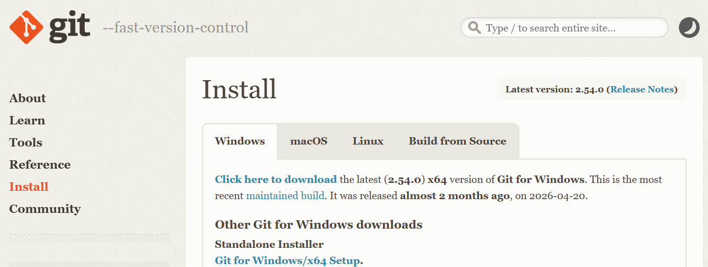
```

  **[For Windows users]**<br>
  
  - Click on "Windows," and download the standalone installer.<br>
  - During the setup wizard, you can safely keep the default options recommended by the installer.

  **[For Mac/macOS users]**<br>
  
  - While you can use the installer from the official website, it is highly recommended to install Git via Homebrew by running the following command in your Terminal:
    ```
    brew install git
    ```

#### 2.2 Create a Github Account<br>
Just as you need a Google account to access a shared Google Doc, you need a GitHub account to access the team's cloud workspace. Once created, share your username with your project manager so they can grant you access to the repository.

#### 2.3 Connect RStudio to Github<br>
This setup creates a direct link between the team's cloud repository and your PC. Once completed, your RStudio environment will be fully synchronized with GitHub and ready for using the "Pull" and "Push" buttons inside RStudio.

**Steps to connect RStudio to Github:**<br>

a. Select **"New Project"** from the Project menu (top-right corner or via File > New Project) in RStudio.<br>
b. Select **"Version Control"** from the project creation wizard window.<br>
```{r, echo=FALSE, out.width="70%", fig.align="left"}
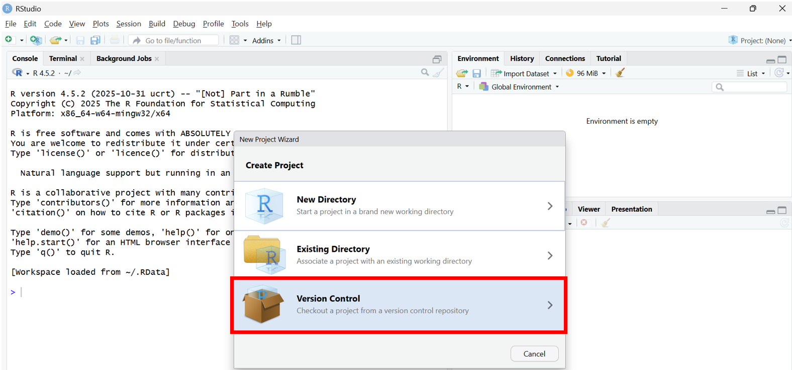
```
c. Select **"Git"** as your version control software.<br>
```{r, echo=FALSE, out.width="70%", fig.align="left"}
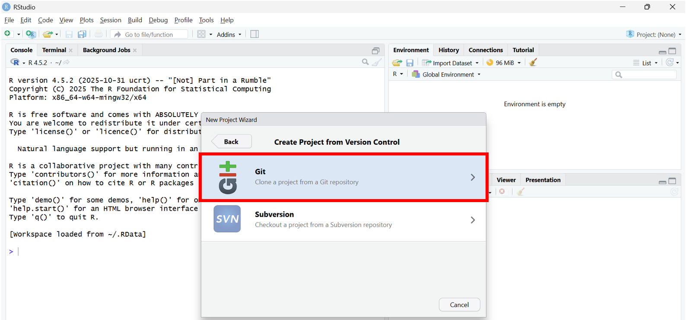
```
d. Copy the Repository URL from the GitHub project page (if you do not have it, request the URL from your project manager).<br>
```{r, echo=FALSE, out.width="70%", fig.align="left"}
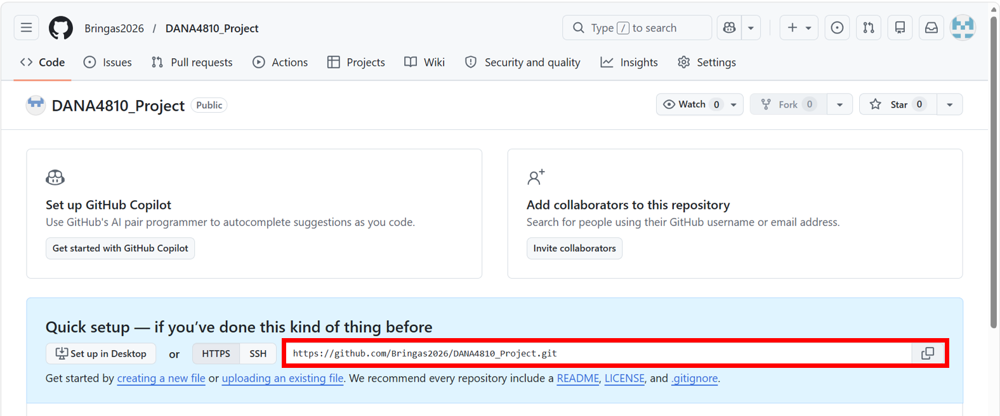
```
e. Paste the copied URL into the **"Repository URL"** text box back in RStudio. Then, click the "Create Project" button. The "Project directory name" field will automatically populate based on the repository name.<br>
```{r, echo=FALSE, out.width="70%", fig.align="left"}
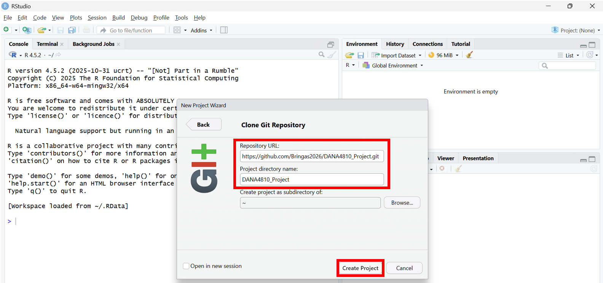
```

f. Confirm the workspace transition: RStudio will automatically refresh and open the new environment. Verify that the "Git" tab is now visible in your Environment pane.<br>
```{r, echo=FALSE, out.width="70%", fig.align="left"}
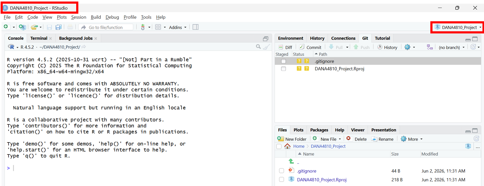
```


#### 2.4 Setup Up Account Information & Credentials<br>
To make sure that each team member's name shows up in Github after pushing, which is quite important to track update history: who made this change, RStudio needs to be linked to appropriate Github account.<br>
 ✅ Make sure to use the exact same email address you used to create your Github account.<br>
 ✅ This will be reflected only your future updates. Past updates cannot be cahnged (although your updates themselves should be safely pushed.)<br>


  How to do that:<br>
  
  1. Set your Github Username
  ```
  git config --global user.name "Your GitHub Username"
  ```
  2. Set your Github Email Address
  ```
  git config --global user.email "Your GitHub Email Address"
  ```


### 3. Basic Operation for Daily Use

**As a Golden Rule of GitHub, always follow this order every single day**

> [PULL]  →  [EDIT]  →  [STAGE]  →  [COMMIT]  →  [PUSH]

✅ Skip "Pull" at the start and you risk creating conflicts with your teammates' work.

---
**As a Key Concept, there are three Git Environments: Local, Staging, and GitHub**<br>
To collaborate effectively, it is essential to understand that Git manages your work across three separate stages, which is a major shift from the automatic, single-layer syncing of Google Docs:

  1. **Local Environment**:<br>
  Your local machine where you open RStudio and edit code. Saving files here affects your local disk only, ensuring a safe sandbox where you can test or break code without impacting others.

  2. **Staging Area**:<br>
  A critical intermediary stage. When you create a "Commit," the files currently in the Staging Area are recorded directly into your Local Repository (your PC's history log). It is crucial to note that committing does NOT send your changes to GitHub yet; your work remains strictly on your local machine until you "Push."

  3. **GitHub (Remote Repository)**:<br>
  The shared cloud infrastructure. Once your staged files are committed, hitting "Push" transfers those snapshots to GitHub, updating the team's official master copy.

Note: The Purpose of Staging<br>
The Staging Area acts as a filter. Instead of throwing all ongoing modifications into the cloud at once, it allows you to selectively package and comment on your changes step-by-step. This structural control is what gives Git its superior version tracking capabilities compared to traditional word processors.

#### 3.1 Open RStudio
Launch the RStudio application on your local machine to begin your workspace.
```{r, echo=FALSE, out.width="80%", fig.align="left"}
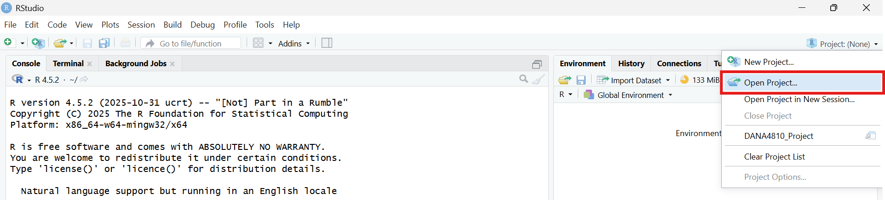
```

#### 3.2 Select a Project
Open your team's designated collaborative project by selecting the corresponding <code>.Rproj</code> file from the project menu.</p>
```{r, echo=FALSE, out.width="30%", fig.align="left"}
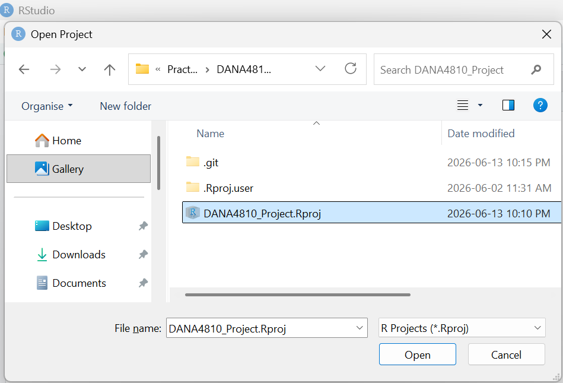
```

#### 3.3 Pull the latest files from GitHub [PULL]
Navigate to the Git tab and click the **"Pull"** button to synchronize your local environment with the latest changes made by your team on GitHub.
Always do this before you start writing any code to prevent future conflicts.
```{r, echo=FALSE, out.width="80%", fig.align="left"}
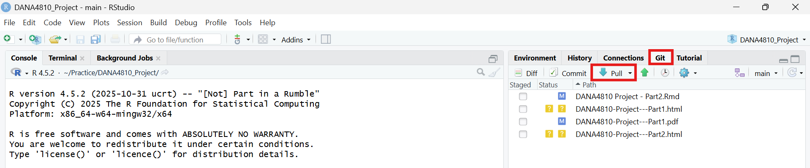
```

#### 3.4 Modify and Save files locally [EDIT]
After completing your edits in files, save your progress locally by pressing <code>Ctrl+S</code> (Windows) or <code>Cmd+S</code> (Mac).</p>
```{r, echo=FALSE, out.width="80%", fig.align="left"}
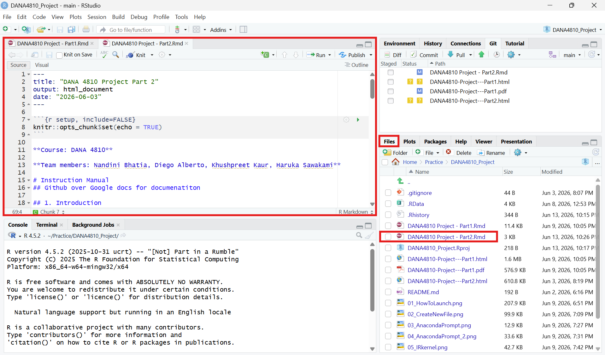
```

#### 3.5 Commit your changes with a clear comment [STAGE&COMMIT]
Check the **"Staged"** box next to the modified files in the Git tab, click **"Commit"**, and log a concise, descriptive **Commit message** explaining your updates.
Note: When making your first commit, RStudio may prompt you to enter your username and email address. If this occurs, please follow the steps in "2.4 Setup Up Account Information & Credentials" to complete the configuration.
```{r, echo=FALSE, out.width="80%", fig.align="left"}
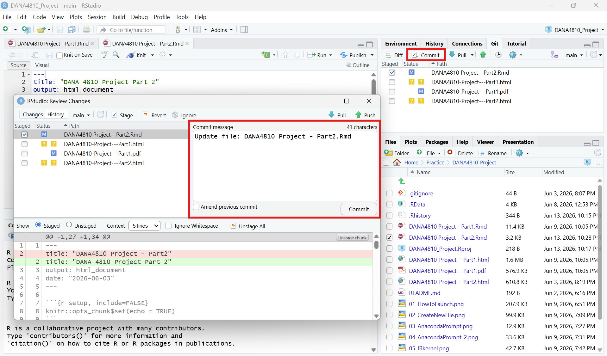
```

#### 3.6 Push your commits to Github [PUSH]
Click the **"Push"** button to upload your recorded local snapshots to the shared GitHub repository, making your contributions visible to the entire team. You may find the **"Push"** button on the previous Commit screen named "Review Changes". Both works in the same way.
```{r, echo=FALSE, out.width="80%", fig.align="left"}
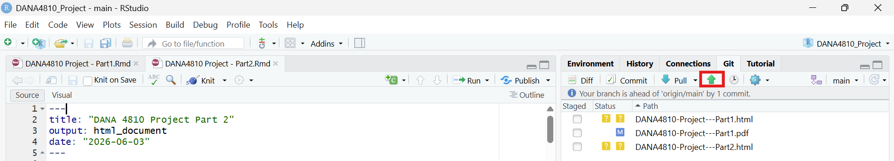
```


### 4. Version Control

Version Control is a good practice that manages changes files over time. It acts like digital audit trails, allowing you to see exactly who made what changes, when and allows to revert to previous states if mistake occurs. While Google Docs automatically saves your work with every single keystroke, GitHub records a "version" (snapshot) only when a user intentionally creates a "Commit."

#### 4.1 How to make a version
As a brief recap from Section 3, your changes are only safely logged as a official "version" once you complete both the Commit and Push operations. Remember, clicking "Commit" records the snapshot to your local history, and clicking "Push" uploads it to GitHub to make it permanent for the team.

**Steps to create a commit in RStudio:**<br>

a. Make and save your changes to the files as normal.<br>
b. In RStudio, open the Git tab (top-right panel).<br>
c. Check the box next to each file you changed — this stages the file.<br>
d. Click Commit.<br>
e. In the box that appears, type a short commit message describing what you did.<br>
f. Click Commit to confirm.<br>

✅ A good commit message answers the question: *"What did this change do?"* — not just *"I changed something."*


#### 4.2 How to check a history and differences
You can review your project's commit history either directly inside **RStudio** or via the **GitHub Web interface**, depending on your needs. Use the <em>RStudio Git History</em> for a quick check on your local incremental changes and code differences (Diff) while working. For a comprehensive, visual overview of all team activities, timeline tracking, and repository-wide updates, reviewing the history on the <em>GitHub Web interface</em> is highly recommended.

**In RStudio:**<br>

- Click the **clock icon** in the Git tab to open the commit history for your project.
```{r, echo=FALSE, out.width="80%", fig.align="left"}
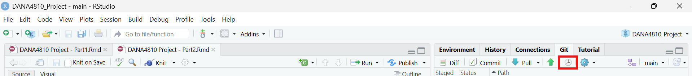
```
- Each row shows the commit message, the author's name, and the date.<br>
- Click any commit to see a **diff** (a colour-coded comparison):<br>

  -  **Green lines** = content that was added<br>
  -  **Red lines** = content that was removed<br>
```{r, echo=FALSE, out.width="70%", fig.align="left"}
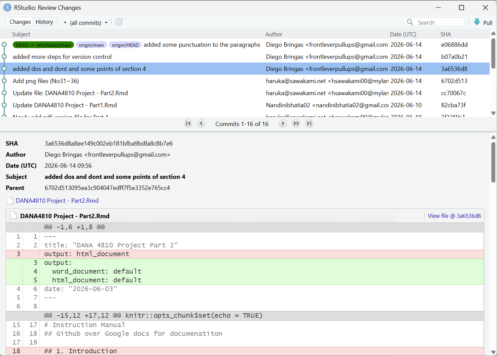
```

**On GitHub.com:**<br>

1. Open your repository on GitHub.<br>
2. Click **Commits** (near the top of the file list) to see the full history.<br>
```{r, echo=FALSE, out.width="70%", fig.align="left"}
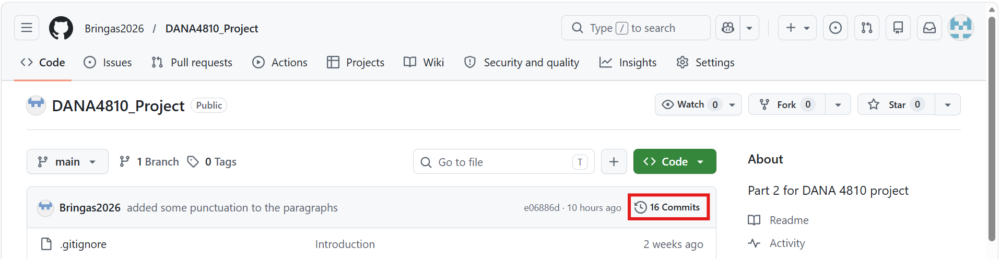
```
3. Click any commit to see exactly which lines were added or removed in every file.<br>
4. To see who wrote each specific line of a file, open the file and click **Blame**. GitHub will annotate every line with the author and the date it was last changed.<br>
```{r, echo=FALSE, out.width="80%", fig.align="left"}
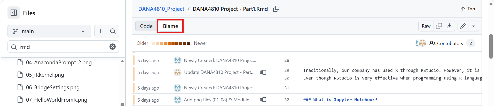
```
   
#### 4.3 How to restore from a Local Changes (Before Commit) / staging area
If you have edited a file but have not yet committed, you can discard your local changes and return the file to the last committed version.<br>

**In RStudio:**<br>

1. In the **Git** tab, right-click the file you want to restore.<br>
2. Select **Revert...** and confirm.<br>

**In the terminal:**<br>

```
git checkout -- filename.Rmd

```

#### 4.4 How to restore from a Past Commit (Local)
If you have already committed a change but want to go back to an earlier version of a specific file, you can restore it using the commit's unique ID (called a **hash**).<br>

**Steps:**<br>

1. Open the **Git** tab in RStudio and click the clock icon to view history.<br>
2. Find the commit you want to restore and copy its short hash / SHA (e.g., `a3f9c12`).<br>
3. In the RStudio terminal, run:<br>

```
git checkout a3f9c12 -- filename.Rmd

```
4. Stage it and commit again:<br>

```
git add filename.Rmd
git commit -m "Restore filename.Rmd to version from [date]"

```

#### 4.5 How to restore from a Github

**Option A — Pull the latest version from GitHub (safest):**

```
git pull origin main

```
This will automatically download any commits made on Github and merge them with your files.

#### 4.6 How to communicate with team members

**Commit messages as communication:**

Good communication is what keeps a team from stepping on each other's work. GitHub gives you several built-in tools for this:

**Commit messages as communication:**

Every commit message is visible to the whole team in the history. Writing clear messages means your teammates always know what you were working on without having to ask.

```
# Examples of helpful commit messages:
"Add Section 3 daily workflow steps"
"Fix merge conflict in introduction"
"Update Do's and Don'ts table with new examples"
```
**GitHub Issues:**

Issues are like a built-in task board inside your repository. You can use them to:

- Report a problem (e.g., "Section 4.2 screenshot is missing")
- Assign tasks to specific team members
- Track progress — close the Issue when the task is done

To create an Issue: Go to your repository on GitHub → click the **Issues** tab → click **New Issue**.

### 4.7 Understanding Branches

A **branch** is an independent copy of the project where you can work freely without affecting the `main` version that everyone shares. Think of it like making a photocopy of a document to draft edits on — you only update the original once you are happy with your changes.

**Why branches matter for teams:**

- Team members can work on different features at the same time without interfering with each other
- The `main` branch always stays clean and working
- If something breaks on your branch, it does not affect anyone else

**How to create a branch in RStudio:**

1. In the Git tab, click the **branch icon** (purple icon near the top right of the Git pane).
2. Type a descriptive name for your branch (e.g., `feature/add-section-5` or `fix/typo-introduction`).
3. Click **Create**. RStudio will automatically switch you to that branch
```{r}

```

=======

### 5. Best Practices for Collaboration

#### 5.1 Do's & Don'ts (Best Practices for Collaboration)

| ✅ Do | ❌ Don't |
|---|---|
| Pull the latest changes from github before starting the work | Start editing without pulling an you will be risking everyone project with that action |
| Commit with understandable, focus and small changes | Make one giant commit at the end of the day |
| Write a clear commit message for every commit | Use vague messages like "updates" or "changes" |
| Work on your own branch for each task | Commit directly to 'main' |
| Open a Pull Request and have a teammate review before merging | Merge your own work without a review |
| Talk to the team before making any huge change | Not talking to anyone before a huge change on the project |
| Use descriptive branch names: 'feature/add-graphics', 'fix/introduction' | Use vague branch names like 'test', 'new', or 'edits' |

#### 5.2 Common Errors & How to resolve Conflicts:

**Error 1: Push Rejected**

```
! [rejected] main -> main (fetch first)
error: failed to push some refs to 'https://github.com/...'
```
```{r, echo=FALSE, out.width="80%", fig.align="left"}
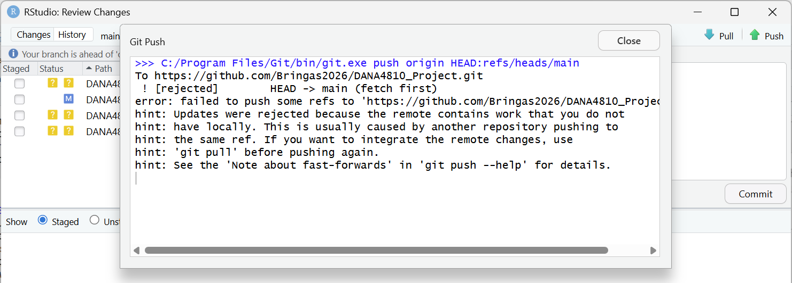
```


**What it means:** Someone else pushed changes to GitHub while you were working. Your local version is now behind the remote version.

**How to fix it:**

```
git pull origin main
```

Pull first to download the new changes, then push again. If there are no conflicts, it will work automatically.

**Error 2: Merge Conflict**

```
CONFLICT (content): Merge conflict in filename.Rmd
Automatic merge failed; fix conflicts and then commit the result.
```

**What it means:** You and a teammate both edited the same lines of the same file, and Git cannot decide which version to keep. Git will mark the conflicting section in the file like this:

```
<<<<<<< HEAD
Your version of the text here
=======
Your teammate's version of the text here
>>>>>>> 4a01c6e40422fa653d0572728deeef8f3726c90e
```

**How to fix it:**

1. Open the file in RStudio. Look for the `<<<<<<<`, `=======`, and `>>>>>>>` markers.
2. Decide which version to keep (or write a combined version).
3. Delete all three marker lines completely.
4. Save the file, stage it, and commit:

```
git add filename.Rmd
git commit -m "Resolve merge conflict in filename.Rmd"
```

> **Tip:** The best way to avoid merge conflicts is to Pull at the start of every session and work on separate files or branches from your teammates.


## References and Sources

1. https://rainsworth.github.io/intro-to-github/06_Collaboration.html
2. https://earthdatascience.org/courses/intro-to-earth-data-science/git-github/github-collaboration/github-for-collaboration-open-science-workflow/
3. https://gitprotect.io/blog/git-revert-file-to-previous-commit/
4. https://gitprotect.io/blog/git-revert-file-to-previous-commit/

## Document Update History

June 15 2026,  New Creation<br>

